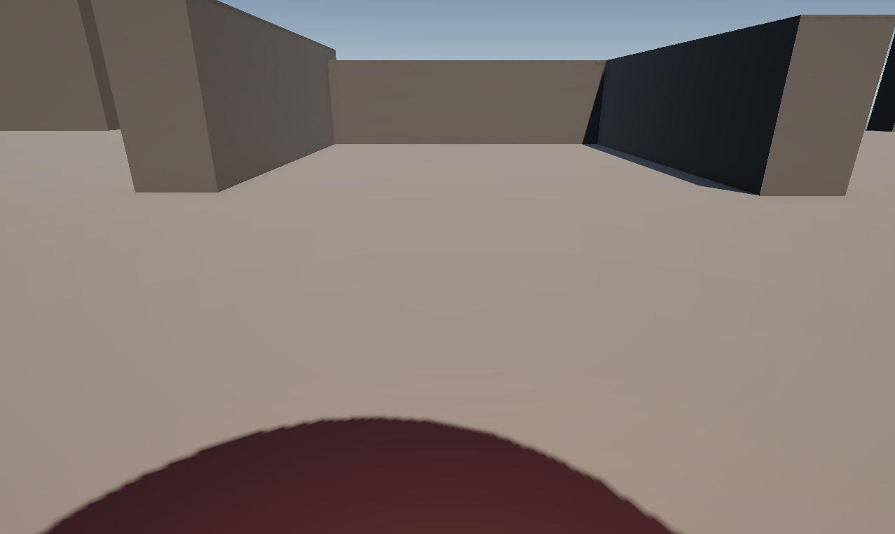

# NullProject β版（個人製作ゲーム）
## プロジェクト概要
※最後まで読んでください！  
NullProjectは個人で製作したUnityゲームです。  
主人公であるボールを転がしてゴールまで運ぶ3Dローリングゲームです。  
ただゴールを目指すだけのシンプルなゲームです。  
アップデートは随時更新予定。
  
  
  

* 制作人数：1名  
* 制作期間：3日間  
* 使用エンジン：Unity Editorバージョン 6000.0.54f1 
* シーンレンダー：Universal 3D  
* 使用言語：C#    
* Fontデータ： Noto Sans JP-Medium SDF (TMP_Font Asset)  
* そのほかの使用ツール：GitHub、SourceTree、VisualStudio  
  
## サンプルゲーム  
ぜひゲームを体験してみてください！  
[NullProjectサンプル](https://hanesheep.github.io/NullProject_web/)  
  
## 操作方法  
前後・左右　移動：WASDキー、または矢印キー  
  
  
## クリアの方法
ステージのとある場所にゴールが設置してあるので、そこに向かってボール（プレイヤー）はまっすぐに動いてゴールに向かいます。  
  
```C#
void Update()
    {
        if (GameManager.gameState != GameState.playing)
        {
            return; //その1フレを強制終了
        }
    }

    private void OnTriggerEnter(Collider collision)
    {
        //ぶつかった相手が"Goal"タグを持っていたら
        if (collision.gameObject.CompareTag("Goal"))
        {
            GameManager.gameState = GameState.gameclear;
            Debug.Log("くりあー");
            Goal();
        }

        //ぶつかった相手が"Dead"タグを持っていたら
        if (collision.gameObject.CompareTag("Dead"))
        {
            GameManager.gameState = GameState.gameover;
            Debug.Log("敗北者");
            GameOver();
        }
    }

    public void Goal()
    {
        GameStop();
    }

    public void GameOver()
    {
        GameStop();

        Destroy(gameObject, 3.0f);
    }

    void GameStop()
    {
        //速度を0にリセット
        rbody.angularVelocity = Vector3.zero;
    }
```
  
## クセのあるボールを駆使してゴールを目指す
移動による慣性（重力）を駆使して動きにくいボールを特定の場所に運びます。  
  
```C#
public class GravityController : MonoBehaviour
{
    const float Gravity = 9.81f;
    public float gravityScale = 1.0f;


    // Update is called once per frame
    void Update()
    {
        Vector3 vector = new Vector3();

        if (Application.isMobilePlatform)
        {
            vector.x = Input.acceleration.x;
            vector.z = Input.acceleration.y;
            vector.y = Input.acceleration.z;
        }
        else
        {
            vector.x = Input.GetAxis("Horizontal");
            vector.z = Input.GetAxis("Vertical");

            if (Input.GetKey("z"))
            {
                vector.y = 1.0f;
            }
            else
            {
                vector.y = -1.0f;
            }
        }

        Physics.gravity = Gravity * vector.normalized * gravityScale;

    }
}
```
## シンプルな操作方法について  
ジャンプやアクションなどの操作は取り除き、短時間でクリアできるゲームを目指しました。  
  
## ゴールの重力設定  
プレイヤーがゴールする際、ゴールと分かるようにplayerが近づいたらゴールに引き込まれるようにしてます。  
``` C#
public bool IsHolding()
    {
        return isHolding;
    }

    private void OnTriggerEnter(Collider other)
    {
        if (other.gameObject.CompareTag("Player"))
        {
            isHolding = true;
        }
    }

    private void OnTriggerExit(Collider other)
    {
        if (other.gameObject.CompareTag(targetTag))
        {
            isHolding = false;
        }
    }

    private void OnTriggerStay(Collider other)
    {
        Rigidbody r = other.gameObject.GetComponent<Rigidbody>();

        Vector3 direction = other.gameObject.transform.position - transform.position;
        direction.Normalize();

        if (other.gameObject.CompareTag("Player"))
        {
            r.angularVelocity *= 0.9f;
            r.AddForce(direction * -50.0f, ForceMode.Acceleration);
        }
        else
        {
            r.AddForce(direction * 70.0f, ForceMode.Acceleration);
        }
    }
```
  
  
## 開発に関する工夫  
### 短期間短時間単作業ゲームを作る  
現在ゲーム市場で流通しているシンプル感のあるゲームを作りたいと思いこのゲームの制作に入りました。  
  
### 納期の意識  
3日間という短い期間で作れる範囲をイメージした際に思い当たったのがシンプルゲームでした。  
またコードも複雑にせずほとんど無駄のないプログラミングを意識しました。  
  
### AIの活用
スケジュールの都合、自分で追いつかない範囲についてはAIを活用しております。  
こちらはコードレビューでAIを活用し、コードの想定通りに動くか、誤った部分の修正案などで活用をしました。  
* 仕様ツール：Google AI Studio　「Gemini 2.5 Pro」  
  
## 今後の課題
ステージが一つだけなのはシンプルすぎるので、複数個作って飽きの来ないような工夫が必要です。  
ゴール演出、ゲームオーバー演出未実装です。  
またカメラワークもプレイヤーに追従する形にしているので、一定距離を離せるような設定もあるとよいかと思います。  
  

